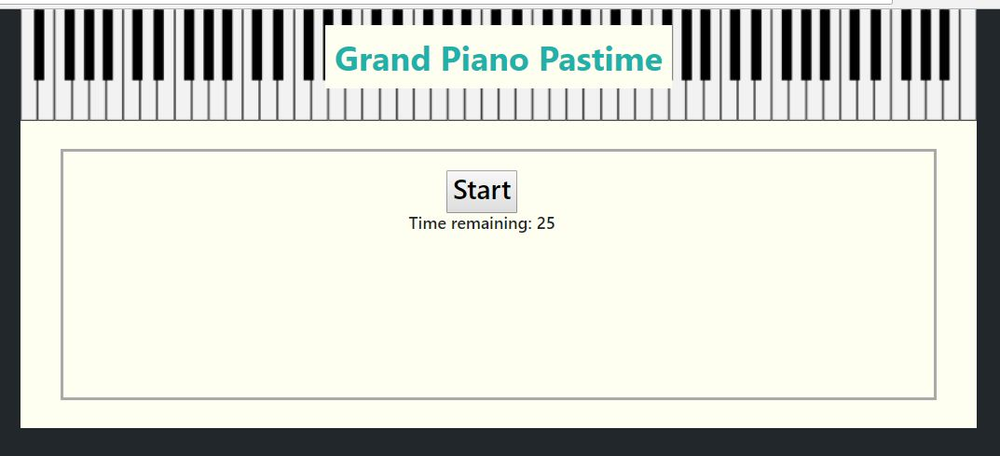
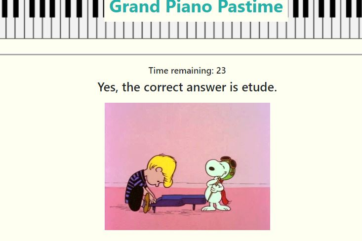
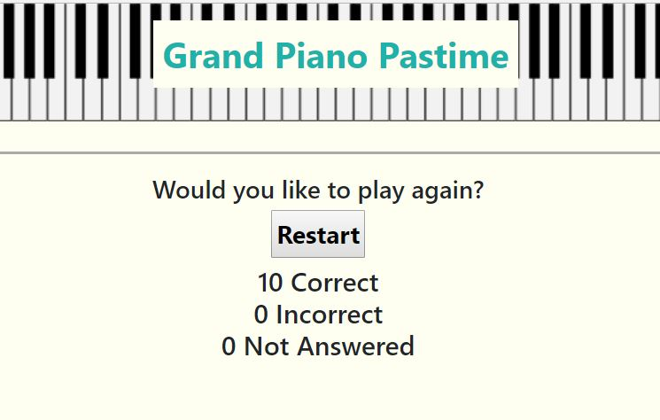

# TriviaGame
This repository is for a Javascript game, using Jquery Bootstrap styling, including radio buttons, constructors, modals and setInterval functionality. The game contains a Javascript file to run the game, an html and css file, and images used in the game.  The styling is created through the use of bootstrap, a css file, and within the html file.  
The game is a tivia game with both the look and questions employing a piano theme.  It consists of ten questions, displayed one at a time; each one must be answered in 25 seconds.  

Play starts when the player clicks the start button.  After the user answers, a short piano-themed gif plays and the next question is displayed.

The player has the option to restart the game at the end.  At the end of the game, the player's stats, the number of right, wrong, and unanswered questions, are displayed.

This project is deployed at  https://marjika.github.io/TriviaGame/ and was created and is maintained by me, Marjika Howarth.
